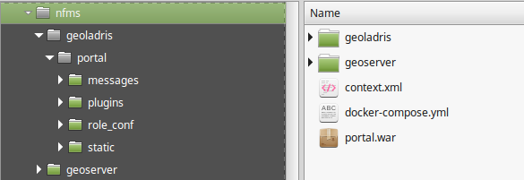

Para este curso haremos uso de [Docker](https://www.docker.com). Docker es una herramienta que nos va a permitir la instalación completa de todos los componentes del sistema de NFMS (PostGIS, GeoServer, portal) en unos pocos minutos y con muy pocos comandos.

## Instalar Docker

La instalación de Docker es diferente en función del sistema operativo. Aquí se muestra el resumen de las posibilidades más comunes.

Si el sistema operativo no se encuentra entre los siguientes, habrá que dirigirse a la [documentación](https://docs.docker.com/engine/installation/) de Docker.

En caso de ser incapaz de instalar Docker de manera nativa en nuestro sistema, siempre se puede crear una máquina virtual Ubuntu con VirtualBox (a partir de [imágenes predefinidas](https://www.osboxes.org/virtualbox-images/), por ejemplo) e instalar Docker en la máquina virtual.

### Ubuntu 16.04 (o posterior)

Se pueden encontrar unas instrucciones más detalladas en la instalación en su [web](https://docs.docker.com/engine/installation/linux/docker-ce/ubuntu/). Básicamente consiste en:

```bash
# Instalar dependencias
apt-get update
apt-get install apt-transport-https ca-certificates curl software-properties-common
# Añadir la clave GPG
curl -fsSL https://download.docker.com/linux/ubuntu/gpg | sudo apt-key add -
# Añadir el repositorio apt
sudo add-apt-repository "deb [arch=amd64] https://download.docker.com/linux/ubuntu $(lsb_release -cs) stable"
# Instalar
apt-get update
apt-get install docker-ce
```

### Windows 10

Se pueden encontrar unas instrucciones más detalladas en la instalación en su [web](https://docs.docker.com/docker-for-windows/install/). Básicamente consiste en:

* Descargar el [instalador](https://download.docker.com/win/stable/Docker%20for%20Windows%20Installer.exe) y ejecutarlo.
* Arrancar `Docker for Windows`.
* Una vez se ha terminado la inicialización se abrirá una consola con el símbolo `$`. Basta con ejecutar `docker run hello-world` para comprobar que la instalación ha sido satisfactoria.

### Windows 7

La última versión de Docker para Windows solo está disponible a partir de Windows 10. Para utilizar Docker en versiones anteriores de Windows habrá que usar [Docker Toolbox](https://docs.docker.com/toolbox/toolbox_install_windows). Básicamente consiste en:

* Descargar el [instalador](https://download.docker.com/win/stable/DockerToolbox.exe) y ejecutarlo.
* Abrir `Docker Quickstart` (por defecto se instala un icono en el escritorio). La primera vez que se abra necesitará ejecutar unos cuantos pasos de configuración inicial que pueden tomar un tiempo y que requieren permisos especiales que habrá que aceptar.
* Una vez se ha terminado la inicialización se abrirá una consola con el símbolo `$`. Basta con ejecutar `docker run hello-world` para comprobar que la instalación ha sido satisfactoria.

## Instalar `docker-compose`

[docker-compose](https://docs.docker.com/compose/) es una herramienta de Docker que nos permite ejecutar, enlazar y en general gestionar varios contenedores de manera conjunta y sencilla.

### Linux

La instalación en Linux es muy sencilla. Basta con descargarlo y darle permisos de ejecución:

```bash
curl -L https://github.com/docker/compose/releases/download/1.18.0/docker-compose-`uname -s`-`uname -m` -o /usr/local/bin/docker-compose
chmod +x /usr/local/bin/docker-compose
docker-compose --version
```

### Windows

En Windows, `docker-compose` viene instalado tanto con `Docker for Windows` como con `Docker Toolbox`, por lo que no será necesario realizar nada más.

### Otros sistemas operativos

Si el sistema operativo no se encuentra entre los anteriores, habrá que dirigirse a la [documentación](https://docs.docker.com/compose/install/) de Docker.

## Arrancar el sistema

Primero deberemos descargarnos y descomprimir un **[paquete](static/docker.zip)** con todos los ficheros necesarios para arrancar el sistema con `docker-compose`. El resultado debería ser el siguiente:



Podemos observar los siguientes ficheros y directorios:

* `geoladris`: [Directorio de configuración](https://geoladris.github.io/doc/user/config/#directorio-de-configuracion) del portal.
* `geoserver`: [Directorio de datos](http://docs.geoserver.org/stable/en/user/datadirectory/index.html) de GeoServer.
* `portal`: El portal. Es una aplicación Tomcat (`.war`) descomprimida.
* `context.xml`: Fichero de configuración para Tomcat.
* `docker-compose.yml`: Fichero de configuración para `docker-compose`.

Posteriormente, bastará con arrancar el sistema con `docker-compose`:

```bash
cd ~/nfms
docker-compose up -d
```

O, en Windows, arrancando `Docker for Windows/Docker Toolbox`:

```bash
cd <directorio>
docker-compose up -d
```

Para comprobar que la instalación y el arranque se han completado con éxito podemos acceder al portal en [http://localhost:8082/portal](http://localhost:8082/portal) y a GeoServer en [http://localhost:8081/geoserver](http://localhost:8081/geoserver).
